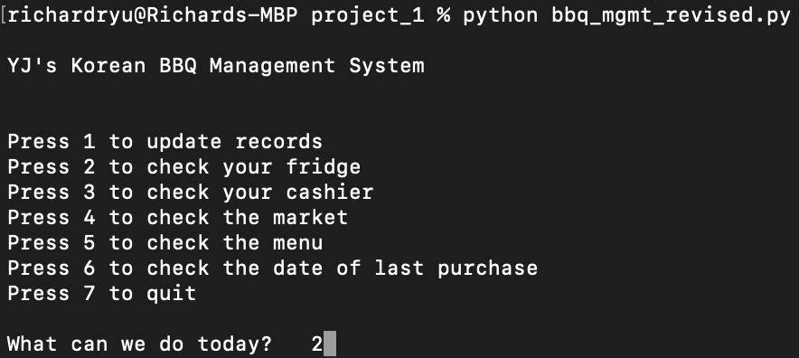
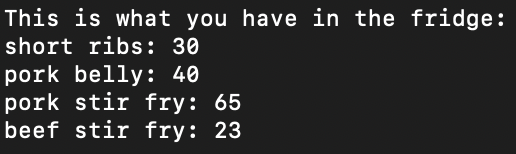
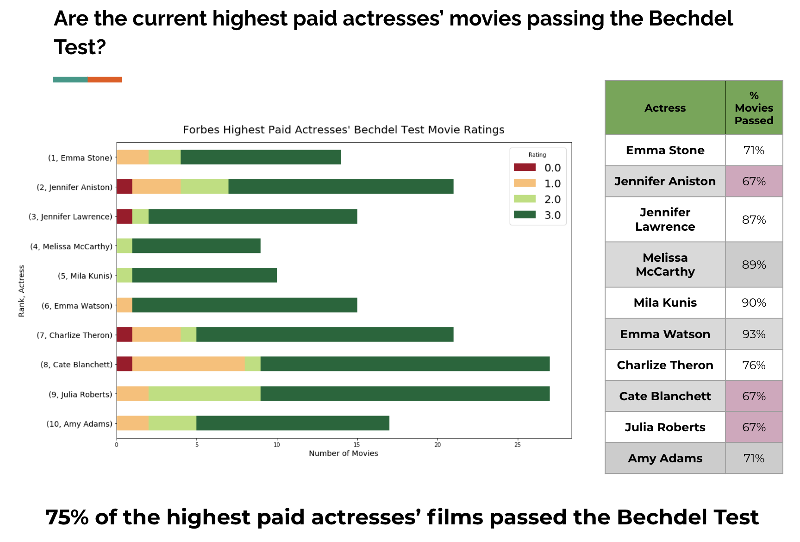
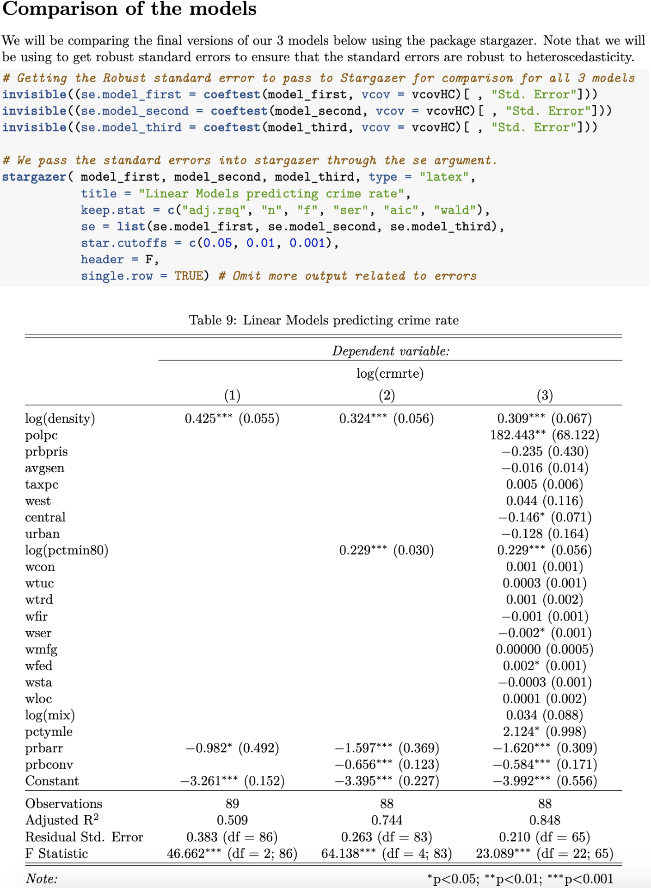
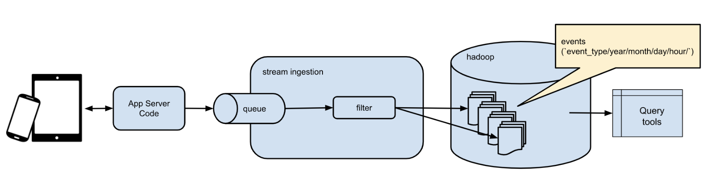
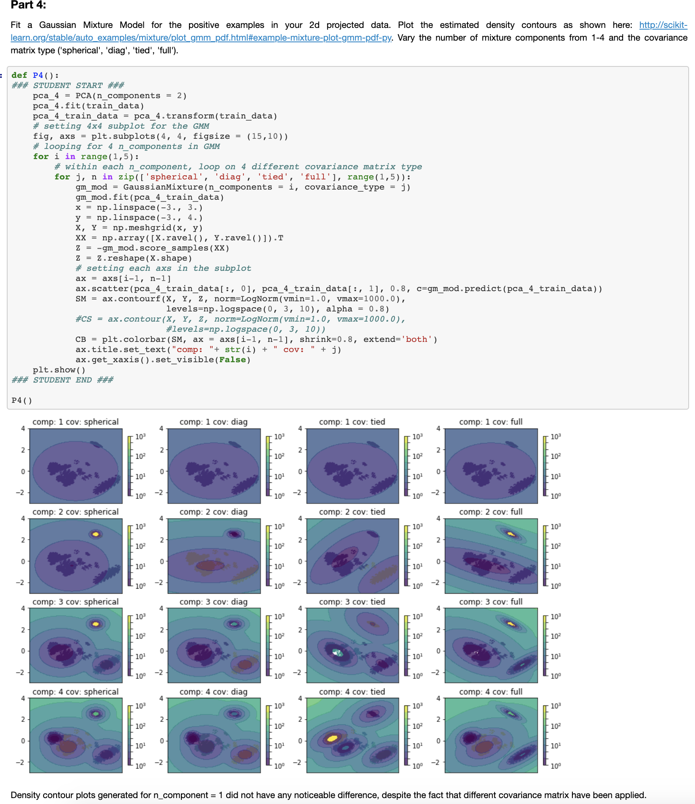
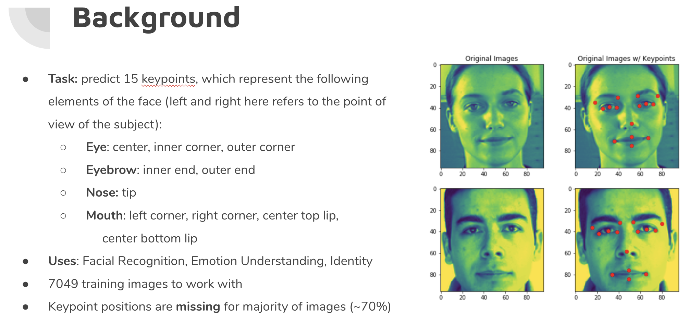
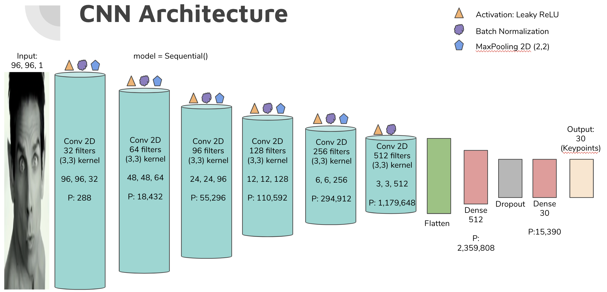
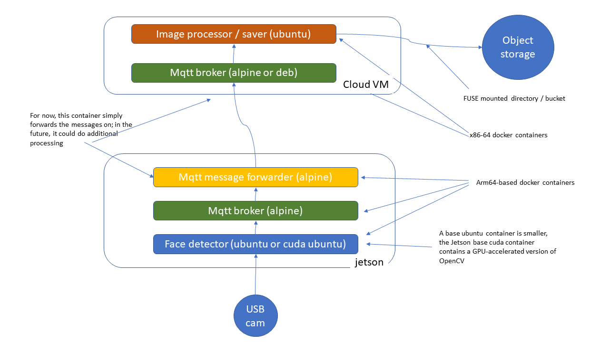

# Richard Ryu


Hello, my name is Richard Ryu and I like to build things and solve problems. I wanted to create a simple webpage that will help you better understand how UC Berkeley Master of Information Data Science transformed a non-technical student who only knew how to read SQL queries.

To be more specific, this will be a short comprehensive review of my time at UC Berkeley Master of Information and Data Science. Each section is chronologically organized by the classes that I took and will include samples of codes, screenshots, and links to my work. If any of the links are broken, please let me know at richard.ryu@ischool.berkeley.edu

[LinkedIn](https://www.linkedin.com/in/richardryu/)

[github](https://github.com/iatechicken/ucbmids)

[Codepen](https://codepen.io/collection/AGwgrw)

[StackOverflow](https://stackoverflow.com/users/10689054/iatechicken)

## W200 Python Fundamental for Data science (2018 Summer)
This was my first "coding" class in an academic setting. Coming in with only 2+ years of SQL and some decent excel skills, there were parts that were easy to understand like If conditions and different data structures like float  vs int. However, what I remember from this class were two things:

1. Great community. Our class was comprised of students with no python background from all ages and all genders. With a common goal of learning, everybody (including the TAs and the instructors) helped each other out and was readily available!

2. Like any languages, English, French, Spanish, or Chinese, there's unbelievable depths and nuisance in Python. To name a quick example, a simple list comprehension can replace a for loop that's 10+ lines long. Productivity can't be measured by the volume of code, yet we should try to evaluate the quality of the code that's being produced.


### Highlights
- Object Oriented Programming, Functional Programming
- Data Structures
- EDA in Python (pandas, numpy, matpotlib)
- Git
- Pseudo-coding

### Mid Term Project: [BBQ Management system](https://github.com/iatechicken/ucbmids/blob/master/W200/BBQ_MGMT_revised.py)
- First python application I ever wrote! A restaurant management application for my friend's Korean BBQ restaurant

  

  

### Final Project: [Bechdel Analysis](https://docs.google.com/presentation/d/1vHQwoAiBGeFzBr6I7qQ5OstKaOVww4e4v5RFkw12f6o/edit?usp=sharing)

- Used pandas on webscraped data from Box Office Mojo and IMDB

  

## W203 Statistics for Data Science (2019 Summer)
I took a year break after my first semester at UC Berkeley MIDS due to my commitments as a product manager. However, I decided to re-prioritize and return to school full-time by taking Statistics and Data Engineering during the summer of 2019.

### Highlights
- Probability Theory and foundational understanding of classical statistics and how it fits within the broader context of data science

- learned and used R for most assignments

### Final Project: Linear Regression on North Carolina Crime data

- The consulting group Significant Effects, comprised of data scientists Jeff Li, Vasanth Ramani, and Richard Ryu, has been tasked by a political campaign to identify determinants of crime

- Came up with 3 different linear regression models to predict crime in North Carolina

- Evaluate the models through: CLM assumptions and fit

[pdf version](./W203/sig_eff.pdf)

- 

## W205 Fundamentals of Data Engineering (2019 Summer)
I was always fascinated by the fast moving lines of log on a terminal. I got a chance to watch a lot of that in work, when I participated in a project to switch the host infrastructure of our web platform from AWS to Microsoft Azure. By the time I was done with W205 Data Engineering, I think I have a general idea of what all those fast moving lines of logs were doing.

### Highlights
- First introduction to the world of dockers, cloud services (GCP), data pipeline, query, transformation, and streaming
- Kafka, Flask, Spark

### Final Project: Instrument an API server to catch and analyze events for a mobile gaming company

- Each weekly assignments build up to the final project where we put it all together in a single data pipeline. Tools and packages leveraged in the final pipeline:
    - dockers
    - Kafka
    - Flask
    - Hadoop HDFS
    - PySpark SQL
    - Pandas, Jupyter Notebook, Numpy



- [step by step annotations](./W205/README.md)

## W209 Data Visualization (2019 Fall)
I was a bit hesitant to take this class since I already had decent business intelligence/data visualization background. I'm proficient with Tableau and have delivered data visualizations to managers of global pharmaceutical companies through SiSense and Microsoft PowerBI. However, this class made me realize that we're all actually spoiled by the data visualization tools out there. A lot of the fundamental concepts/theory behind designing a good data visualization that we learned in this class, is already selected/guided by tools such as Tableau or SiSense. We not only learned the fundamentals of good data visualization, but also learned how to code our own data visualization through D3.js. After all, a picture is worth more than thousand words.

### Highlights
- Main exposure to D3.js, with general front-end concepts
- Data visualization concepts, theory, etc.
- A picture is worth more than thousand words
- Tableau
[D3.js examples](https://codepen.io/collection/AGwgrw)

### Final Project: MOSS Dashboard
- Created a dashboard that will visualize the outcome of [LIME](https://github.com/marcotcr/lime)
[github](https://github.com/jlee-snn/w209_MOSS)
[Final Presentation](https://docs.google.com/presentation/d/1LEihVbGMWBkUKJHeLqjL8jqGFBDI-Ceae-GL_Bp2Blw/edit?usp=sharing)

## W207 Applied Machine Learning (2019 Fall)
This was my official introduction to Machine Learning. Yes, it took only about a year before I actually got the chance to do Machine Learning. I got a chance to learn from Yacov Salomon and one thing I will remember the most is his whiteboard and always dry markers... and how he always emphasized the importance of understanding the intuition behind any algorithms. To get a better understanding of what I mean, take a look at the Q&A below from one of the assignments:

```
Q: Any ideas why logistic regression doesn't work as well as Naive Bayes?

A: The difference between Naive Bayes and logistic regression is that Naive Bayes assumes independence amongst features while logistic regression looks for relationships between features. Since we're dealing with more than 2,000 features, the logistic regression will perform badly due to complexity. If we want to improve the performance of our logistic regression model, we must reduce the number of features
```

### Highlights

- Heavy Exposure: sklearn, numpy, matplotlib
- Code Sample from one of the Assignments analyzing poisonous mushrooms:


    - I think this is the level of technical expectation that's expected from us, about half way into the program. Many differences and improvements can be noticed from my first python code :D. However, I do want to emphasize that my experience at UCB MIDS would not have been possible without all the positive/constructive participation of my fellow classmates, the TAs, and the instructors. Thank you to them.

### Final Project: Kaggle - Facial Keypoint Detection Challenge
- This was my first [Kaggle](https://www.kaggle.com/c/facial-keypoints-detection) competition.

- Used Keras, tensorflow, skimage, sklearn, pandas, numpy, matplotlib, CUDA, CuDNN

[presentation](https://docs.google.com/presentation/d/1IPMNdfzN4TBaobklF8pnc0rI8l8BjUV2utph3ZmKl4Q/edit?usp=sharing)

[github](https://github.com/iatechicken/kaggle_rnd/blob/master/FinalProject_FacialKepoints_RnD.ipynb)





## W251 Deep Learning in the Cloud at the Edge (2020 Spring)
Despite the fact that data is growing at an exponential rate, there are so many un-captured data in the wild. This is where edge computing comes in and what this class is all about. Our first task was to setup a NVIDIA Jetson TX-2 with ubuntu. With the Jetson and IBM Cloud, we got to experiment with various algorithms of Deep Learning and truly appreciate the possibilities of big data.

If you're not sure what Jetson TX-2 is, Bin Wang provided a nice video below that basically describes the first week of class for us.

<iframe width="560" height="315" src="https://www.youtube.com/embed/Nls0zG-Sqh4" frameborder="0" allow="accelerometer; autoplay; encrypted-media; gyroscope; picture-in-picture" allowfullscreen></iframe>

### Highlights
- Heavy exposure to dockers, IBM cloud, dev/ops, IoT, edge computing, deep learning, NVDIA Jetson TX-2
- Tuning models to safely land a lunar lander on moon [github](https://github.com/iatechicken/w251/tree/master/hw11)

- Trained a Transformer-based Machine Translation Network on a small English to German WMT corpus [github](https://github.com/iatechicken/w251/tree/master/hw09)
- Capture facial images from a webcam that is attached to the Jetson TX-2. Then, send the captured facial images to the cloud object storage on IBM virtual servers using MQTT [github](https://github.com/iatechicken/w251/tree/master/new_hw03)



### Final Project: Kaggle - Deep Fake Detection Challenge
- Participate in the [Deepfake Detection Challenge](https://www.kaggle.com/c/deepfake-detection-challenge) to predict whether or not a particular video is a deep fake
- Used IBM Cloud for the pipeline
- Leveraged MTCNN, mixnet_m, LSTM, PyTorch, CUDA 10.0 for training
- Achieved an accuracy of ~ 88.81% and log loss of 0.25, when predicting videos with a single face captured

[github](https://github.com/zengm71/DeepFakeChallenge)

[presentation](https://docs.google.com/presentation/d/1bLG81qy8hxRKJf5ctfp-ONL1mlF2sWr9PHhFOPh2MSE/edit?usp=sharing)


Real Video             |  Fake Video
:-------------------------:|:-------------------------:
  |  

## W261 Machine Learning at Scale (2020 Spring)
### Highlights
3 goals achieved in Kyle Hamilton's class (thank you for all the dad jokes of data science despite teaching back-to-back classes after long days of work. You are the real MVP!):
1. learn to recognize and apply key concepts in parallel computation and MapReduce design
2. design stateless parallelizable implementations of core machine learning algorithms from scratch
3. gain hands-on experience using Apache Hadoop and Apache Spark to analyze large datasets
- Lots of Hadoop, Spark and databricks

### Final Project: Predict Airlines Delay

## W210 Capstone (2020 Summer)
This is it. Putting everything together, I teamed up with Hong, Michelle, and Rachael to come up with [AccessiPark Denver](http://accessipark.com). Our plan was to:
- First, train a model to detect street-level accessibility obstacles like lamps, fire hydrants, no parking signs
- Second, Find areas from a zipcode level with the least amount of accessibility obstacles
- Third, use feature engineering, googlemaps, and data visualization to disseminate this information

### Highlights
- Train YOLOv5 on custom labelled images [colab](https://colab.research.google.com/drive/1mHWPAjytYcGhQ3LzPV4TjaOshTEG7T3L?usp=sharing)
- googlemaps reverse_geocode

```
# You will need an active googlemaps API code
# david = pd.DataFrame(columns=['new_lat', 'new_long'])

import googlemaps
gmaps = googlemaps.Client(key = 'your API key')

for i in list(range(len(david))):
    temp_result = gmaps.reverse_geocode((david.loc[i,'new_lat'], david.loc[i, 'new_long']), result_type = "postal_code")
    david.loc[i, 'zipcode'] = temp_result[0].get('address_components')[0].get('long_name')
```

- For more details and code samples of all the feature engineering required for this project, please refer to the README.md on our project [github](https://github.com/sunh0003/W210Capstone-AccessibleParkingMap)

```
# You will need an active googlemaps API code
# david = pd.DataFrame(columns=['new_lat', 'new_long'])

import googlemaps
gmaps = googlemaps.Client(key = 'your API key')

for i in list(range(len(david))):
    temp_result = gmaps.reverse_geocode((david.loc[i,'new_lat'], david.loc[i, 'new_long']), result_type = "postal_code")
    david.loc[i, 'zipcode'] = temp_result[0].get('address_components')[0].get('long_name')
```

- [github](https://github.com/sunh0003/W210Capstone-AccessibleParkingMap/tree/master)

<iframe width="560" height="315" src="https://www.youtube.com/embed/IzchReC1kxI" frameborder="0" allow="accelerometer; autoplay; encrypted-media; gyroscope; picture-in-picture" allowfullscreen></iframe>
